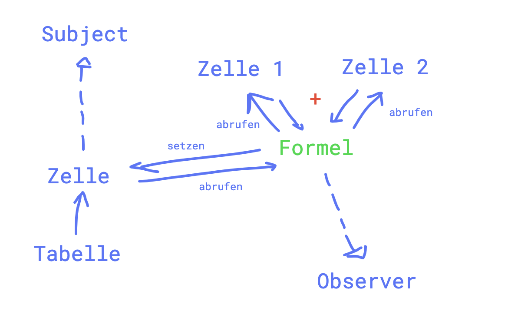

# sew-4bhit-l7b2

Andreas Sünder, 04.01.2023

Für diese Aufgabe wurde das Pull-Prinzip des Observer-Pattern verwendet (mir gefällt es prinzipiell mehr als das Push-Prinzip). Des Weiteren findet man hier die Besonderheit, dass `Formula` und `Cell` nicht lose gekoppelt sind. Das hat damit zu tun, dass beide Klassen eng zusammengehören (zu jeder `Formula` gehört auch eine `Cell`, umgekehrt auch - solange eine `Formula` gesetzt worden ist). Die zwei weiteren `Cell`s, auf die jede `Formula` referenziert, sind dafür (mehr oder weniger) lose gekoppelt, da diese nicht so eng zusammengehören. Das heißt also, sollte sich irgendetwas an `cell1` oder `cell2` ändern, dann (wenn nötig) eine `Formula`, die sich selbst als Observer registriert hat, aktualisiert. Darauf rechnet die `Formula` ihren Wert neu aus und speichert ihn in die zuständige `Cell` ab.  

Schemenhafter Ablauf:

Klassendiagramm:

